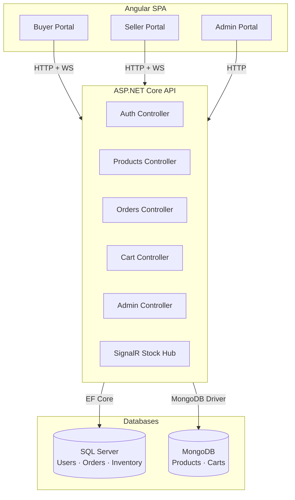
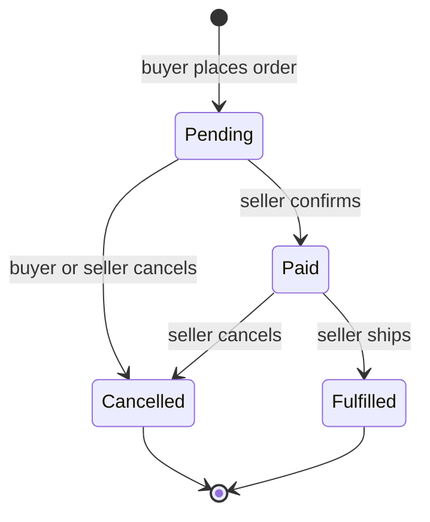
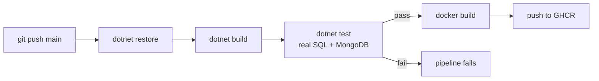

# Architecture

## System overview

```mermaid
graph TB
    subgraph Frontend["Angular SPA"]
        BP[Buyer Portal]
        SP[Seller Portal]
        AP[Admin Portal]
    end

    subgraph API["ASP.NET Core API"]
        AC[Auth Controller]
        PC[Products Controller]
        OC[Orders Controller]
        CC[Cart Controller]
        ADC[Admin Controller]
        HUB[SignalR Stock Hub]
    end

    subgraph Storage["Databases"]
        SQL[(SQL Server\nUsers · Orders · Inventory)]
        MONGO[(MongoDB\nProducts · Carts)]
    end

    BP -->|HTTP + WS| API
    SP -->|HTTP + WS| API
    AP -->|HTTP| API
    API -->|EF Core| SQL
    API -->|MongoDB Driver| MONGO
```

## Order state machine

```mermaid
stateDiagram-v2
    [*] --> Pending: buyer places order
    Pending --> Paid: seller confirms
    Pending --> Cancelled: buyer or seller cancels
    Paid --> Fulfilled: seller ships
    Paid --> Cancelled: seller cancels
    Cancelled --> [*]
    Fulfilled --> [*]
```

## CI/CD pipeline

```mermaid
graph LR
    Push[git push main] --> Restore[dotnet restore]
    Restore --> Build[dotnet build]
    Build --> Test[dotnet test\nreal SQL + MongoDB]
    Test -->|pass| Docker[docker build]
    Docker --> Push2[push to GHCR]
    Test -->|fail| Stop[pipeline fails]
```